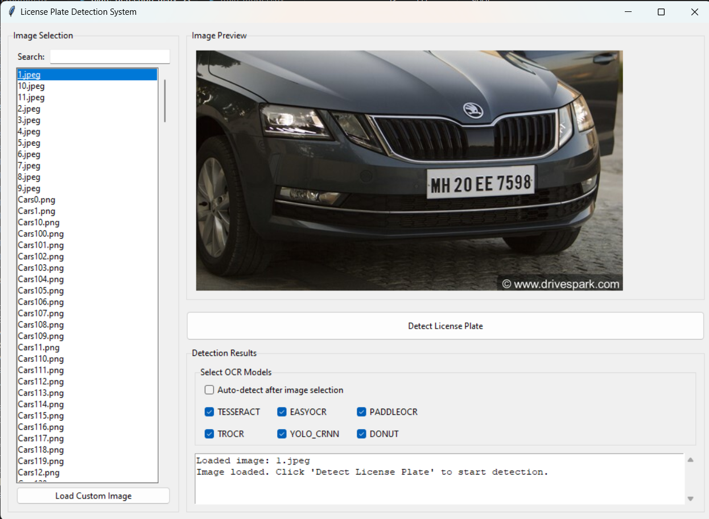
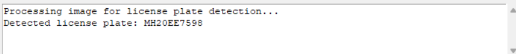

# License Plate Detection System

A comprehensive system for detecting and recognizing license plates in images using multiple OCR engines and computer vision techniques.

## Project Overview

This project implements a license plate detection and recognition system that uses multiple OCR (Optical Character Recognition) models to accurately detect and read license plates from images. The system employs a multi-model voting approach to improve recognition accuracy by combining the strengths of various OCR technologies.

### Features

- Multi-model license plate recognition (Tesseract, EasyOCR, PaddleOCR, TrOCR, etc.)
- Automatic license plate detection using computer vision techniques
- Model voting system for improved recognition accuracy
- Graphical user interface for easy interaction
- Support for various image formats
- Ability to process both individual images and batches

## Technologies Used

- Python 3.x
- OpenCV for image processing
- PyTesseract (Tesseract OCR wrapper)
- EasyOCR for deep learning-based OCR
- PaddleOCR for high-accuracy OCR
- Microsoft's TrOCR (Transformer-based OCR)
- Tkinter for the graphical user interface
- NumPy for numerical operations
- Pillow (PIL) for image handling

## Youtube Link
<a href="https://www.youtube.com/watch?v=BYCZ38Xl1Ww&ab_channel=shadowX2406">Video</a>

## Installation

### Prerequisites

- Python 3.7 or higher
- Tesseract OCR engine installed (included in the OCR folder)

### Setup

1. Clone the repository or download the project files:

```powershell
git clone https://github.com/KanhaiyaChhaparwal24/license-plate-detection.git
cd license-plate-detection
```

2. Install the required packages:

```powershell
pip install -r requirements.txt
```

## Usage

### Command Line Interface

Run the main script to start the command-line interface:

```powershell
python Program.py
```

You'll be presented with options to:
1. Process images from the Dataset folder
2. Process a custom image by providing the full path
3. Select specific OCR models to use

### Graphical User Interface

For a more user-friendly experience, you can use the graphical interface:

```powershell
python plate_detection_ui.py
```

The GUI allows you to:
- Browse and select images from the images folder
- Load custom images from any location
- Select which OCR models to use
- View the detection results in real-time

#### GUI Showcase

Here's a visual walkthrough of the application:

1. **Initial UI**: The application on startup
   
   

2. **Image Selection**: After selecting an image from the list
   
   

3. **Detection Results**: After license plate detection
   
   

## Project Structure

- `Program.py`: The main program with OCR implementations
- `plate_detection_ui.py`: Graphical user interface
- `images/`: Contains example car images
- `OCR/`: Contains Tesseract OCR executable and related files
- `trained_models/`: Directory for custom trained models
- `train_models.py`: Script for training custom OCR models


## How It Works

1. **Image Processing**:
   - The system first preprocesses the input image using various techniques like blurring, thresholding, and morphological operations.

2. **License Plate Detection**:
   - Computer vision algorithms are used to identify potential license plate regions based on shape, size, and other characteristics.

3. **OCR Processing**:
   - Multiple OCR engines process the detected regions.
   - Each model returns the detected text and a confidence score.

4. **Result Selection**:
   - A voting mechanism selects the best result based on frequency and confidence.
   - The most commonly detected text with the highest confidence is chosen.

## Customization

You can customize the system by:
- Adding new OCR models
- Tuning the detection parameters
- Training custom OCR models for specific types of license plates using `train_models.py`

## Contributors

- **<a href="https://www.linkedin.com/in/kanhaiya-chhaparwal/">Kanhaiya Chhaparwal</a>**
- **<a href="https://www.linkedin.com/in/AnujSule/">Anuj Sule</a>**
- **<a href="https://www.linkedin.com/in/divyaksh-chachan/">Divyaksh Chachan</a>**
- **<a href="https://www.linkedin.com/in/harshkasundra/">Harsh Kasundra</a>**

## Acknowledgments

- Tesseract OCR community
- EasyOCR developers
- PaddleOCR team
- Microsoft for the TrOCR model
